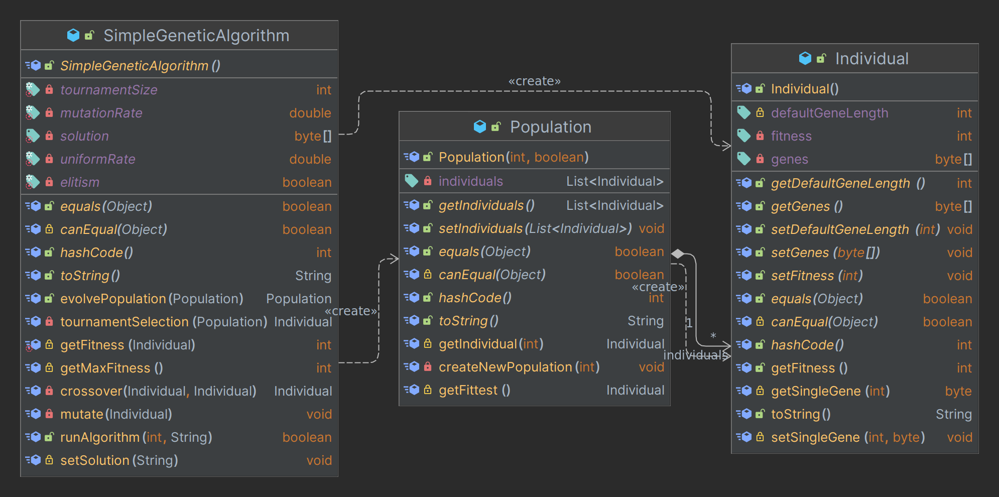

# Analyse de la solution d'algorithme génétique de Baeldung
[lien vers l'article](https://www.baeldung.com/java-genetic-algorithm)

L'énoncé est le suivant: prendre les classes `Individual`, `Population` et `SimpleGeneticAlgorithm` du repository Github lié à l'article sus-mentionné.

Cet article nous présente une façon from scratch d'établir un algorithme génétique en Java. Dans ce mini-article, je vais passer points par points les améliorations qui peuvent êtres faites. Chaque étapes verra son propre package Java contenant le code relatif à l'étape.

## Étape 00: Identification des problèmes



Il y a trois classes dans le package original.

| Classe                   | Description                                                               |
|--------------------------|---------------------------------------------------------------------------|
| `SimpleGeneticAlgorithm` | qui va contenir toute la logique de l'algorithme                          |
| `Population`             | c'est une classe qui contiendra chaque individus dans un certain exercice |
| `Individual`             | elle va déterminer les différents attributs dudit individu.               |

Comme chaque classe possède son lot de soucis, je vais y aller classe par classe

### `Individual`

Cette classe est la classe la plus bas niveau dans notre structure de code. Théoriquement, elle ne dépends d'aucune autre classes.

Or, pratiquement, la classe dépends d'une méthode statique de la classe `SimpleGeneticAlgorithm`: `getFitness(Individual)`.

Le soucis dans cette solution, c'est l'invocation d'une fonction statique depuis une classe qui est une dépendance de la classe mère de la fonction statique: ceci soulève une dépendence cyclométrique. Pour palier à cela, il faut regarder en détail ce que cette fonction fait.

```java
// Dans SimpleGeneticAlgorithm.java
protected static int getFitness(Individual individual) {
    int fitness = 0;
    for (int i = 0; i < individual.getDefaultGeneLength() && i < solution.length; i++) {
        if (individual.getSingleGene(i) == solution[i]) {
            fitness++;
        }
    }
    return fitness;
}

// Dans Individual.java
public int getFitness() {
    if (fitness == 0) {
        fitness = SimpleGeneticAlgorithm.getFitness(this);
    }
    return fitness;
}
```

Aparemment la méthode de `Individual` va appeler la fonction statique de `SimpleGeneticAlgorithm` afin de calculer la fitness de l'individu qui est passé en paramètre pour ensuite stocker cette information dans un attribut de la classe `Individual`.

Premièrement, stocker une valeur calculée dans un attribut de classe n'a aucun sens que le caching de cette valeur. De plus, ce calcul est effectué dans une classe qui créé les objets de type `Individual`.

Ensuite, la classe `Individual` est non-nécessairement mutable. Nous pouvons alors, avec les nouvelles versions de Java, créer un `record` nommé `Individual`.

```java
public record Individual(
    byte[] gene
) { }
```

Ici, la seule donnée que l'on a besoin est la donnée de la génétique. Il n'y a pas besoin d'y stocker la fitness car cela irait à l'encontre de l'immutabilité de la classe.

Le constructeur initial

```java
public Individual() {
    for (int i = 0; i < genes.length; i++) {
        byte gene = (byte) Math.round(Math.random());
        genes[i] = gene;
    }
}
```

est un constructeur fautif dans le sens où il possède de la logique de création. Nous allons créer une autre classe appelée `IndividualFactory`. Elle respectera cette structure:

```java
class IndividualFactory {
    private int geneSize;
    
    public Individual generateRandomIndividual();
}
```

### `Population`

Cette classe, originellement, s'occupait de la génération d'une population ainsi que du calcul de la fitness. Ces deux points vont êtres les principales modifications du code de la classe.

Premièrement, comme la classe `Individual`, nous pouvons rendre cette classe immutable par l'utilisation des records java.

Ensuite, la logique de création va être transférée dans une classe à elle même: `PopulationFactory`.

Enfin, la logique de calcul de la fitness n'a pas à avoir lieu dans cette classe. Elle sera donc ignorée.

### `SimpleGeneticAlgorithm`

Cette classe est composée de 5 attributs (qui ne sont en fait que des paramètres), un constructeur et 12 méthodes/fonctions. Commençons par les attributs.

Voyons les différents attributs de la classe:

| Attribut         | Description                                                                                |
|------------------|--------------------------------------------------------------------------------------------|
| `uniformRate`    | Taux de crossover                                                                          |
| `mutationRate`   | Taux de mutation dans un gène                                                              |
| `tournamentSize` | La taille d'un tournoi dans le cas de l'utilisation de l'algorithme "Tournament Selection" |
| `elitism`        | ?                                                                                          |
| `solution`       | Variable typiquement utilisée pour calculer le fitness.                                    |


